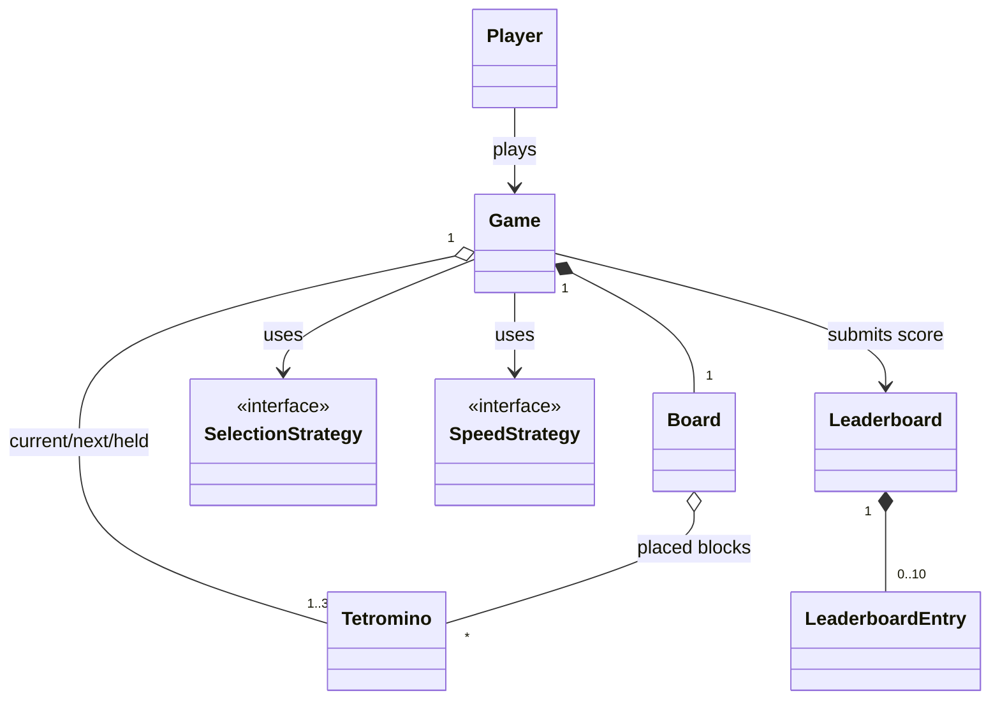

```mermaid
classDiagram
    direction TB

    class Game {
    }

    class Board {
    }

    class Tetromino {
    }

    class SelectionStrategy {
        <<interface>>
    }

    class SpeedStrategy {
        <<interface>>
    }

    class Leaderboard {
    }

    class LeaderboardEntry {
    }

    class Player {
    }

    Game "1" *-- "1" Board
    Game "1" o-- "1..3" Tetromino : current/next/held
    Game --> SelectionStrategy : uses
    Game --> SpeedStrategy : uses
    Game --> Leaderboard : submits score
    Board o-- "*" Tetromino : placed blocks
    Leaderboard "1" *-- "0..10" LeaderboardEntry
    Player --> Game : plays
```
